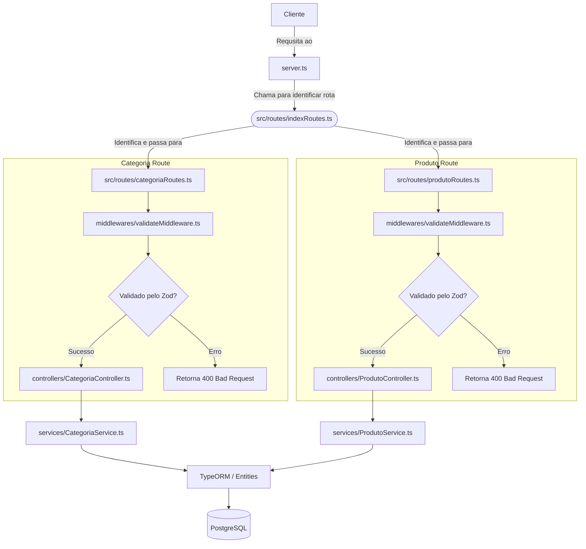

```mermaid
flowchart TD
    Client[Cliente] --> |Requsita ao| Server[server.ts]

    Server --> |Chama para identificar rota| indexRoutes([src/routes/indexRoutes.ts])

    indexRoutes --> |Identifica e passa para| catRoute[src/routes/categoriaRoutes.ts]
    indexRoutes --> |Identifica e passa para| prodRoute[src/routes/produtoRoutes.ts]

    subgraph Categoria Route
        catRoute --> CatValMidd[middlewares/validateMiddleware.ts]
        CatValMidd --> catSchema{Validado pelo Zod?}
        catSchema -- "Sucesso" --> CatCtrl[controllers/CategoriaController.ts]
        catSchema -- "Erro" --> catZodErr[Retorna 400 Bad Request]
    end

    subgraph Produto Route
        prodRoute --> ProdValMidd[middlewares/validateMiddleware.ts]
        ProdValMidd --> prodSchema{Validado pelo Zod?}
        prodSchema -- "Sucesso" --> ProdCtrl[controllers/ProdutoController.ts]
        prodSchema -- "Erro" --> prodZodErr[Retorna 400 Bad Request]
    end

    CatCtrl --> CatServ[services/CategoriaService.ts]
    ProdCtrl --> ProdServ[services/ProdutoService.ts]

    CatServ & ProdServ --> TypeORM[TypeORM / Entities]
    TypeORM --> DB[(PostgreSQL)]
```
